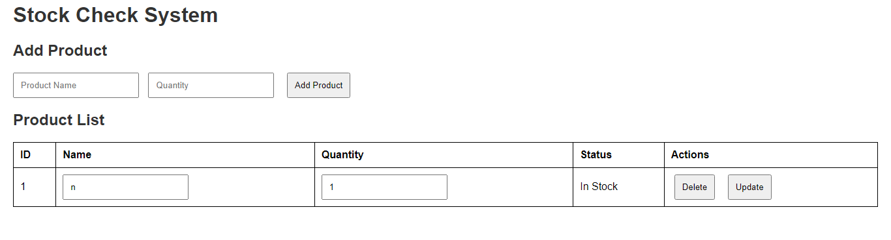

# Stock Check System

## Overview

The Stock Check System is a web application that allows users to manage product stock levels. It utilizes an ASP.NET Core Web API for backend services and static HTML/CSS/JavaScript files for the frontend.



## Technologies Used

- **Backend**: 
  - ASP.NET Core
  - Entity Framework Core (In-Memory Database)
  - CORS for cross-origin requests
  - Swagger for API documentation

- **Frontend**: 
  - HTML
  - CSS
  - JavaScript (Fetch API for making HTTP requests)

## Project Structure

```
StockCheckSystem
│   StockCheckSystem.sln
│
├───StockCheckSystem.API
│   │   appsettings.Development.json
│   │   appsettings.json
│   │   Program.cs
│   │   StockCheckSystem.API.csproj
│   │   StockCheckSystem.API.http
│   │
│   ├───bin
│   ├───Controllers
│   │       ProductController.cs
│   │
│   ├───Data
│   │       AppDbContext.cs
│   │
│   ├───Models
│   │       Product.cs
│   │
│   ├───obj
│   └───Properties
│           launchSettings.json
│
└───wwwroot
        app.js
        index.html
        styles.css
```

## Getting Started

### Prerequisites

- .NET SDK (version 8.0 or higher)
- A web browser (Chrome, Firefox, etc.)

### Running the Project

1. **Clone the repository:**

   ```bash
   git clone <repository-url>
   cd StockCheckSystem
   ```

2. **Navigate to the API project:**

   ```bash
   cd StockCheckSystem.API
   ```

3. **Run the API:**

   ```bash
   dotnet run
   ```

   This will start the API at `https://localhost:5001`.

4. **Access the frontend:**

   Open your web browser and navigate to:

   ```
   https://localhost:5001/index.html
   ```
   
    Or, Put the index.html into the browser. 
    
    **Osv**, don't open the link that API generates because otherwise it won't work.

### API Documentation

The API is documented using Swagger. You can access it at:

```
https://localhost:5001/swagger
```

### Features

- **CRUD Operations** for managing products
- **CORS Support** for cross-origin requests
- **In-memory Database** for quick development and testing

## Contributing

Feel free to fork the repository and submit pull requests for improvements or new features.

## License

This project is licensed under the MIT License - see the [LICENSE](LICENSE) file for details.
```

Feel free to modify the template as needed for your specific project details!
